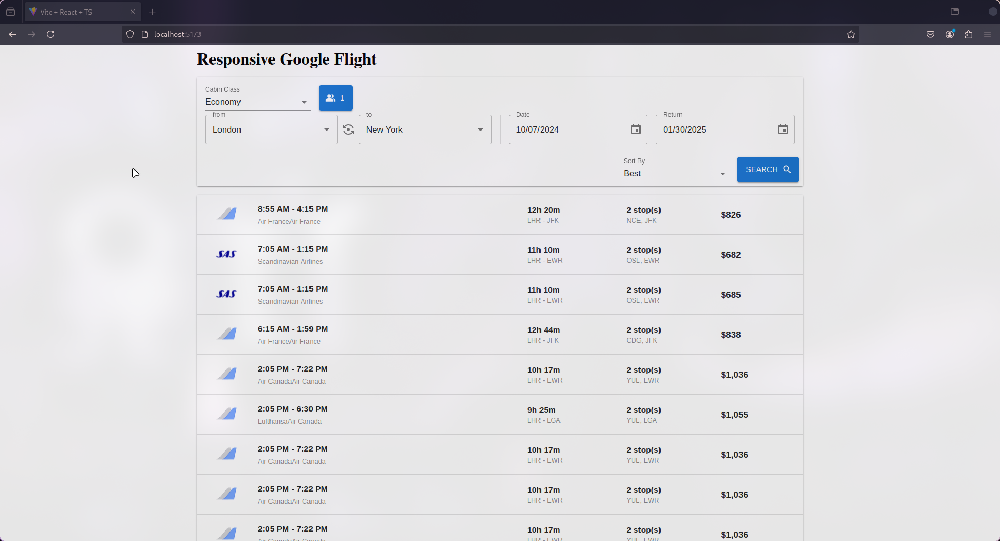

# Responsive Google Flight with React and Material UI

## Loom Video Walkthrough

Watch the video below for code explanation and demo:

[Watch the demo video on Loom](https://www.loom.com/share/c8e9c40b8b944b8199ae9ee3df00bbbc)

## Overview

This project implements a responsive version of Google Flight, created using React and Material UI. It leverages the Air Scraper API to fetch and display real-time flight data, offering users a smooth and intuitive interface to search for flights.

## Results

### 1. Best Flights

