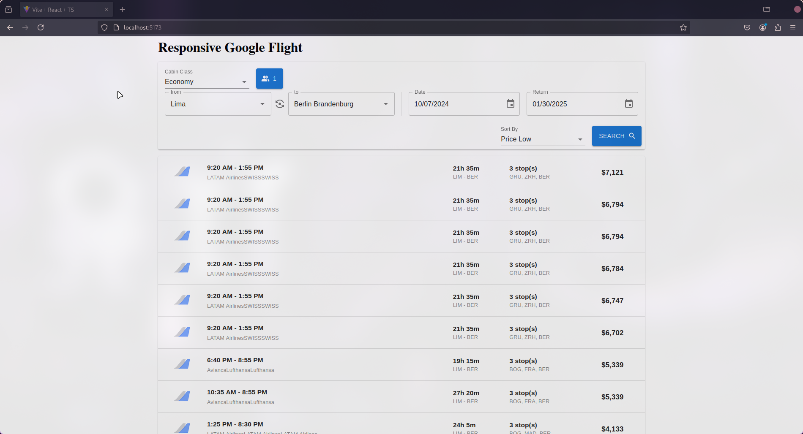
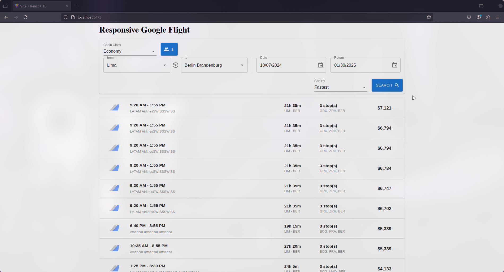

# Responsive Google Flight with React and Material UI

## Overview

This project implements a responsive version of Google Flight, created using React and Material UI. It leverages the Air Scraper API to fetch and display real-time flight data, offering users a smooth and intuitive interface to search for flights.

## Results

### 1. Best Flights

### 2. Desc Price Flights

### 3. Fastest Flights

